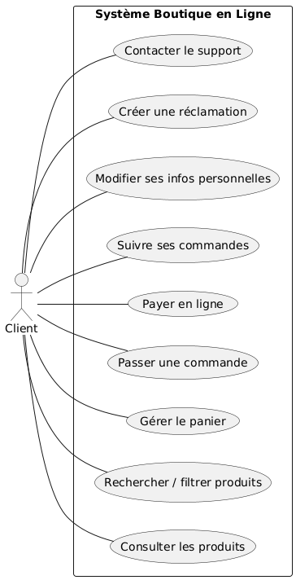
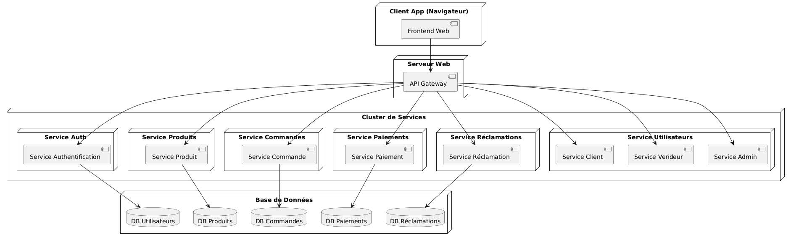
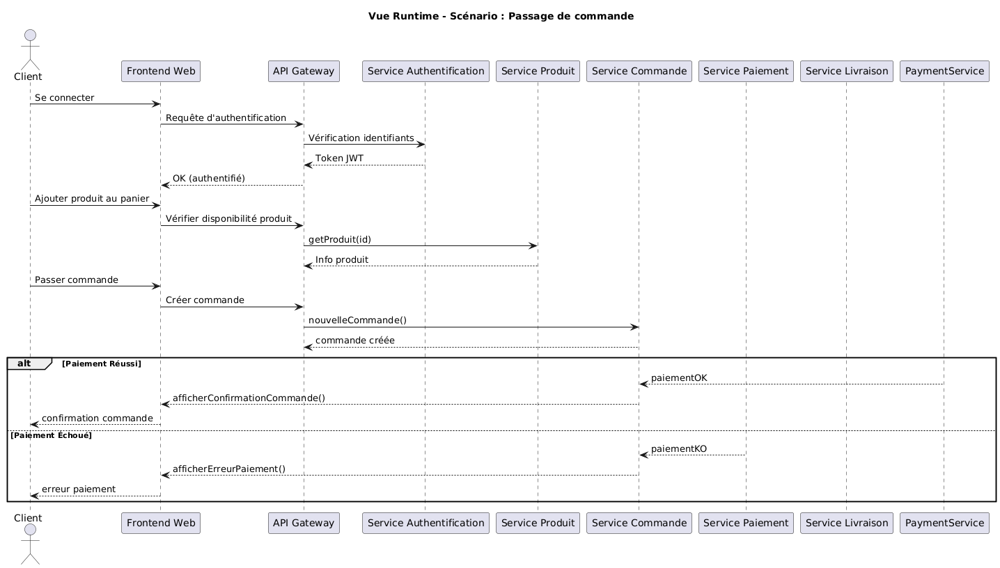

# 🛒 Système de Boutique en Ligne – Cahier des Besoins

## ✅ Modules et Sous-Modules

### 🔹 Module 1 : Espace Client

#### 1.1 Sous-module Navigation et Catalogue
- Parcourir les catégories de produits
- Recherche de produits par mot-clé
- Filtres par prix, marque, catégorie, etc.
- Affichage des détails du produit

#### 1.2 Sous-module Panier
- Ajouter un produit au panier
- Modifier la quantité
- Supprimer un produit
- Affichage du total

#### 1.3 Sous-module Commande
- Passer une commande
- Suivre ses commandes
- Historique des commandes

#### 1.4 Sous-module Compte Utilisateur
- Inscription et authentification
- Gestion des informations personnelles
- Changement de mot de passe
- Gestion des adresses de livraison

#### 1.5 Sous-module Réclamations / Assistance
- Soumettre une réclamation
- Suivre la réclamation
- Contacter le support

---

### 🔹 Module 2 : Espace Vendeur

#### 2.1 Gestion des Produits
- Ajouter un nouveau produit
- Modifier un produit existant
- Supprimer un produit
- Consulter la liste de ses produits
- Gérer les stocks disponibles

#### 2.2 Suivi des Commandes
- Consulter les commandes passées par les clients
- Marquer une commande comme traitée/expédiée

#### 2.3 Gestion du Profil Vendeur
- Modifier ses informations personnelles
- Suivre ses performances de vente

---

### 🔹 Module 3 : Espace Administrateur

#### 3.1 Supervision générale
- Valider ou suspendre un compte vendeur
- Gérer les utilisateurs (clients, vendeurs)
- Gérer les réclamations non résolues
- Accès aux statistiques globales de la plateforme

#### 3.2 Statistiques
- Chiffre d’affaires global
- Produits les plus vendus
- Suivi des ventes par vendeur

---

## 📐 Besoins Non Fonctionnels

- **Utilisabilité**
  - Interface claire, responsive et intuitive pour clients, vendeurs, et administrateurs
  - Interface dédiée pour chaque rôle

- **Compatibilité**
  - Responsive design (PC, tablette, mobile)
  - Support des principaux navigateurs

- **Performance**
  - Temps de réponse < 2 secondes
  - Chargement rapide des produits et des commandes

- **Fiabilité**
  - Haute disponibilité (24h/24, 7j/7, sauf maintenance planifiée)
  - Sauvegardes régulières des données

- **Sécurité**
  - Mots de passe cryptés avec `BCrypt`
  - Sessions sécurisées via `JWT`
  - Paiements intégrés avec sécurité (ex: Stripe, PayPal)
  - Accès restreint par rôle (ACL)

- **Évolutivité**
  - Capacité à accueillir plusieurs vendeurs et milliers de produits
  - Architecture prête à intégrer d'autres modules (livraison, retours, promotions…)

## 🌐 Vue de Contexte

Cette vue montre les interactions du système avec les acteurs externes : client, vendeur, administrateur, services de paiement et de livraison.

### 📌 Description :
- **Client** : Navigue, commande, suit ses achats.
- **Vendeur** : Gère ses produits et traite les commandes.
- **Administrateur** : Supervise la plateforme.
- **Services externes** : Paiement sécurisé et gestion logistique.

---

# 👥 Conception par Acteur – Boutique en Ligne

## 👤 1. Client

### 🎯 Rôle :
L’acteur principal du système. Il navigue sur le site pour consulter, acheter, suivre ses commandes et interagir avec le service client.

### 🧩 Modules concernés :
- Espace Client (Navigateur Web)
- Services : Produit, Commande, Paiement, Réclamation, Authentification

### 🔧 Fonctionnalités :
- Consulter les produits (filtrage, recherche, catégories)
- Ajouter des produits au panier
- Passer une commande
- Payer en ligne de manière sécurisée
- Suivre ses commandes
- S’inscrire et se connecter
- Modifier ses informations personnelles
- Ajouter, consulter ou supprimer une réclamation
- Contacter le support

---

## 🛍️ 2. Vendeur

### 🎯 Rôle :
Utilisateur professionnel ayant un espace personnel lui permettant de publier et gérer ses propres produits, ainsi que de traiter les commandes liées à ses articles.

### 🧩 Modules concernés :
- Espace Vendeur
- Services : Produit, Commande, Authentification, Statistiques (limitées)

### 🔧 Fonctionnalités :
- Créer, modifier, ou supprimer un produit
- Gérer les stocks disponibles
- Suivre les commandes liées à ses produits
- Marquer des commandes comme expédiées
- Consulter ses ventes ou statistiques personnelles
- Modifier son profil vendeur
- Se connecter et gérer son compte

---

## 🛡️ 3. Administrateur

### 🎯 Rôle :
Supervise le fonctionnement global de la plateforme. Il n’intervient pas directement dans la vente, mais surveille les vendeurs, utilisateurs, et la qualité du service.

### 🧩 Modules concernés :
- Espace Administrateur
- Services : Utilisateur, Réclamation, Statistiques, Authentification

### 🔧 Fonctionnalités :
- Gérer les comptes vendeurs (validation, suspension)
- Supprimer un utilisateur ou vendeur en cas de non-conformité
- Suivre et répondre aux réclamations non traitées
- Consulter les statistiques globales de la boutique
- Superviser l’activité des produits et des ventes
- Gérer l'accès et les rôles utilisateur
- Garantir la conformité des publications

---

## 🖧 Vue de Déploiement

Cette vue décrit la structure d’hébergement du système : navigateurs, passerelle API, services indépendants, et bases de données.

### 📌 Composants principaux :
- **Frontend Web** (navigateur)
- **API Gateway** (point d’entrée unique)
- **Microservices** (auth, produit, commande, paiement, réclamation…)
- **Bases de données** spécifiques à chaque domaine

---

## ⚙️ Vue Runtime – Scénario : Passage de Commande

Ce diagramme illustre l'exécution dynamique du système lors du scénario typique d’un client qui passe une commande en ligne.

### 🧩 Étapes :
1. Connexion
2. Consultation produit
3. Création commande
4. Paiement
5. Livraison

## 🧱 Vue Building Block – Architecture des Composants

La vue **Building Block** présente l'architecture interne du système de la boutique en ligne. Elle met en évidence les principaux composants logiciels (ou "blocs") qui composent le système, leurs responsabilités et leurs interactions via une architecture orientée microservices.

### 📌 Description des Blocs

- **Frontend Web Client** :  
  Interface utilisateur disponible via navigateur pour clients, vendeurs et administrateurs.

- **API Gateway** :  
  Point d'entrée unique pour l'ensemble des requêtes. Elle redirige vers les services appropriés.

- **Service Authentification** :  
  Gère la connexion, l'inscription, les tokens JWT, et la sécurité des accès.

- **Service Client** :  
  Gère les données personnelles, adresses, et interactions des clients.

- **Service Vendeur** :  
  Permet aux vendeurs de gérer leur boutique (produits, commandes, stock).

- **Service Commande** :  
  Gère le panier, les commandes, le suivi et l’historique.

- **Service Paiement** :  
  Intègre des services externes (Stripe, PayPal) et valide les paiements.

- **Service Produit** :  
  Gère les produits, les catégories, les descriptions et le stock disponible.

- **Service Réclamation** :  
  Gère les demandes et réclamations des utilisateurs et leur suivi.

- **Service Admin** :  
  Gère les utilisateurs, les vendeurs, les statistiques et la supervision générale.

- **Bases de Données** :
  - `DB Utilisateurs` : Clients, vendeurs, administrateurs
  - `DB Produits` : Informations produits et stock
  - `DB Commandes` : Historique et statut des commandes
  - `DB Réclamations` : Données des réclamations client
  - `DB Paiements` : Données de transaction sécurisées

### 🖼 Diagramme Building Block

---

Cette architecture permet une scalabilité horizontale, une séparation claire des responsabilités et une maintenance facilitée grâce à l’indépendance des modules.

