# 🛒 Système de Boutique en Ligne – Cahier des Besoins
## 📖 Introduction Générale

Ce document présente le cahier des besoins pour un système de boutique en ligne. Il décrit les fonctionnalités principales, les modules impliqués, les besoins non fonctionnels, ainsi que les vues architecturales nécessaires pour concevoir et développer la plateforme. Ce système vise à offrir une expérience utilisateur fluide et sécurisée pour les clients, les vendeurs et les administrateurs.

---

## 📋 Table des Matières

1. [✅ Modules et Sous-Modules](#-modules-et-sous-modules)  
  - [🔹 Module 1 : Espace Client](#-module-1--espace-client)  
  - [🔹 Module 2 : Espace Vendeur](#-module-2--espace-vendeur)  
  - [🔹 Module 3 : Espace Administrateur](#-module-3--espace-administrateur)  

2. [📐 Besoins Non Fonctionnels](#-besoins-non-fonctionnels)  

3. [🌐 Vue de Contexte](#-vue-de-contexte)  

4. [👥 Conception par Acteur – Boutique en Ligne](#-conception-par-acteur--boutique-en-ligne)  
  - [👤 Client](#-1-client)  
  - [🛍️ Vendeur](#-2-vendeur)  
  - [🛡️ Administrateur](#-3-administrateur)  

5. [🖧 Vue de Déploiement](#-vue-de-déploiement)  

6. [⚙️ Vue Runtime – Scénario : Passage de Commande](#-vue-runtime--scénario--passage-de-commande)  
## ✅ Modules et Sous-Modules

### 🔹 Module 1 : Espace Client

#### 1.1 Sous-module Navigation et Catalogue
- Parcourir les catégories de produits
- Recherche de produits par mot-clé
- Filtres par prix, marque, catégorie, etc.
- Affichage des détails du produit

#### 1.2 Sous-module Panier
- Ajouter un produit au panier
- Modifier la quantité
- Supprimer un produit
- Affichage du total

#### 1.3 Sous-module Commande
- Passer une commande
- Suivre ses commandes
- Historique des commandes

#### 1.4 Sous-module Compte Utilisateur
- Inscription et authentification
- Gestion des informations personnelles
- Changement de mot de passe
- Gestion des adresses de livraison

#### 1.5 Sous-module Réclamations / Assistance
- Soumettre une réclamation
- Suivre la réclamation
- Contacter le support

---

### 🔹 Module 2 : Espace Vendeur

#### 2.1 Gestion des Produits
- Ajouter un nouveau produit
- Modifier un produit existant
- Supprimer un produit
- Consulter la liste de ses produits
- Gérer les stocks disponibles

#### 2.2 Suivi des Commandes
- Consulter les commandes passées par les clients
- Marquer une commande comme traitée/expédiée

#### 2.3 Gestion du Profil Vendeur
- Modifier ses informations personnelles
- Suivre ses performances de vente

---

### 🔹 Module 3 : Espace Administrateur

#### 3.1 Supervision générale
- Valider ou suspendre un compte vendeur
- Gérer les utilisateurs (clients, vendeurs)
- Gérer les réclamations non résolues
- Accès aux statistiques globales de la plateforme

#### 3.2 Statistiques
- Chiffre d’affaires global
- Produits les plus vendus
- Suivi des ventes par vendeur

---

## 📐 Besoins Non Fonctionnels

- **Utilisabilité**
  - Interface claire, responsive et intuitive pour clients, vendeurs, et administrateurs
  - Interface dédiée pour chaque rôle

- **Compatibilité**
  - Responsive design (PC, tablette, mobile)
  - Support des principaux navigateurs

- **Performance**
  - Temps de réponse < 2 secondes
  - Chargement rapide des produits et des commandes

- **Fiabilité**
  - Haute disponibilité (24h/24, 7j/7, sauf maintenance planifiée)
  - Sauvegardes régulières des données

- **Sécurité**
  - Mots de passe cryptés avec `BCrypt`
  - Sessions sécurisées via `JWT`
  - Paiements intégrés avec sécurité (ex: Stripe, PayPal)
  - Accès restreint par rôle (ACL)

- **Évolutivité**
  - Capacité à accueillir plusieurs vendeurs et milliers de produits
  - Architecture prête à intégrer d'autres modules (livraison, retours, promotions…)

## 🌐 Vue de Contexte

Cette vue montre les interactions du système avec les acteurs externes : client, vendeur, administrateur, services de paiement et de livraison.

### 📌 Description :
- **Client** : Navigue, commande, suit ses achats.
- **Vendeur** : Gère ses produits et traite les commandes.
- **Administrateur** : Supervise la plateforme.
- **Services externes** : Paiement sécurisé et gestion logistique.

---

# 👥 Conception par Acteur – Boutique en Ligne

## 👤 1. Client

### 🎯 Rôle :
L’acteur principal du système. Il navigue sur le site pour consulter, acheter, suivre ses commandes et interagir avec le service client.

### 🧩 Modules concernés :
- Espace Client (Navigateur Web)
- Services : Produit, Commande, Paiement, Réclamation, Authentification

### 🔧 Fonctionnalités :
- Consulter les produits (filtrage, recherche, catégories)
- Ajouter des produits au panier
- Passer une commande
- Payer en ligne de manière sécurisée
- Suivre ses commandes
- S’inscrire et se connecter
- Modifier ses informations personnelles
- Ajouter, consulter ou supprimer une réclamation
- Contacter le support
---

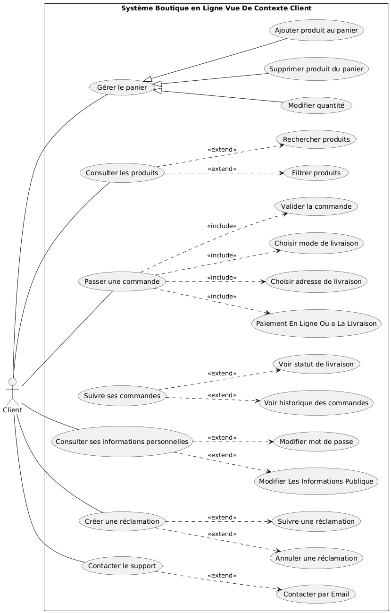

## 🛍️ 2. Vendeur

### 🎯 Rôle :
Utilisateur professionnel ayant un espace personnel lui permettant de publier et gérer ses propres produits, ainsi que de traiter les commandes liées à ses articles.

### 🧩 Modules concernés :
- Espace Vendeur
- Services : Produit, Commande, Authentification, Statistiques (limitées)

### 🔧 Fonctionnalités :
- Créer, modifier, ou supprimer un produit
- Gérer les stocks disponibles
- Suivre les commandes liées à ses produits
- Marquer des commandes comme expédiées
- Consulter ses ventes ou statistiques personnelles
- Modifier son profil vendeur
- Se connecter et gérer son compte

---
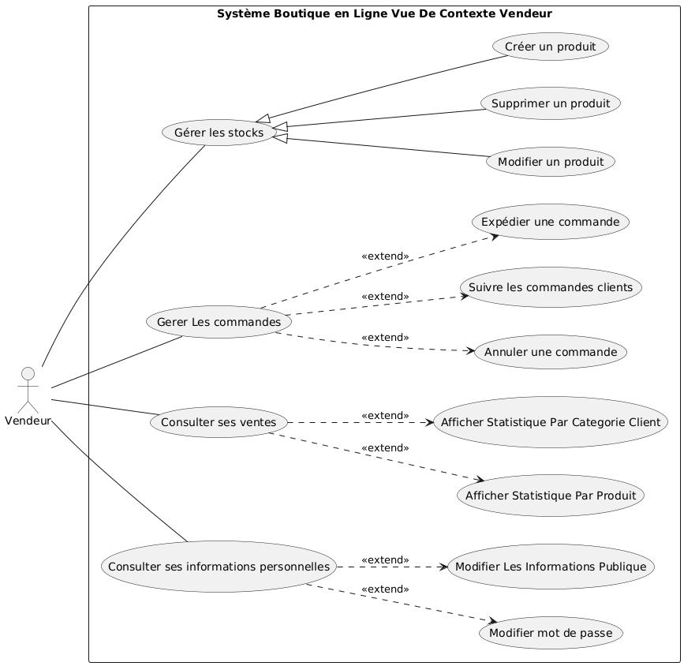
## 🛡️ 3. Administrateur

### 🎯 Rôle :
Supervise le fonctionnement global de la plateforme. Il n’intervient pas directement dans la vente, mais surveille les vendeurs, utilisateurs, et la qualité du service.

### 🧩 Modules concernés :
- Espace Administrateur
- Services : Utilisateur, Réclamation, Statistiques, Authentification

### 🔧 Fonctionnalités :
- Gérer les comptes vendeurs (validation, suspension)
- Supprimer un utilisateur ou vendeur en cas de non-conformité
- Suivre et répondre aux réclamations non traitées
- Consulter les statistiques globales de la boutique
- Superviser l’activité des produits et des ventes
- Gérer l'accès et les rôles utilisateur
- Garantir la conformité des publications

---
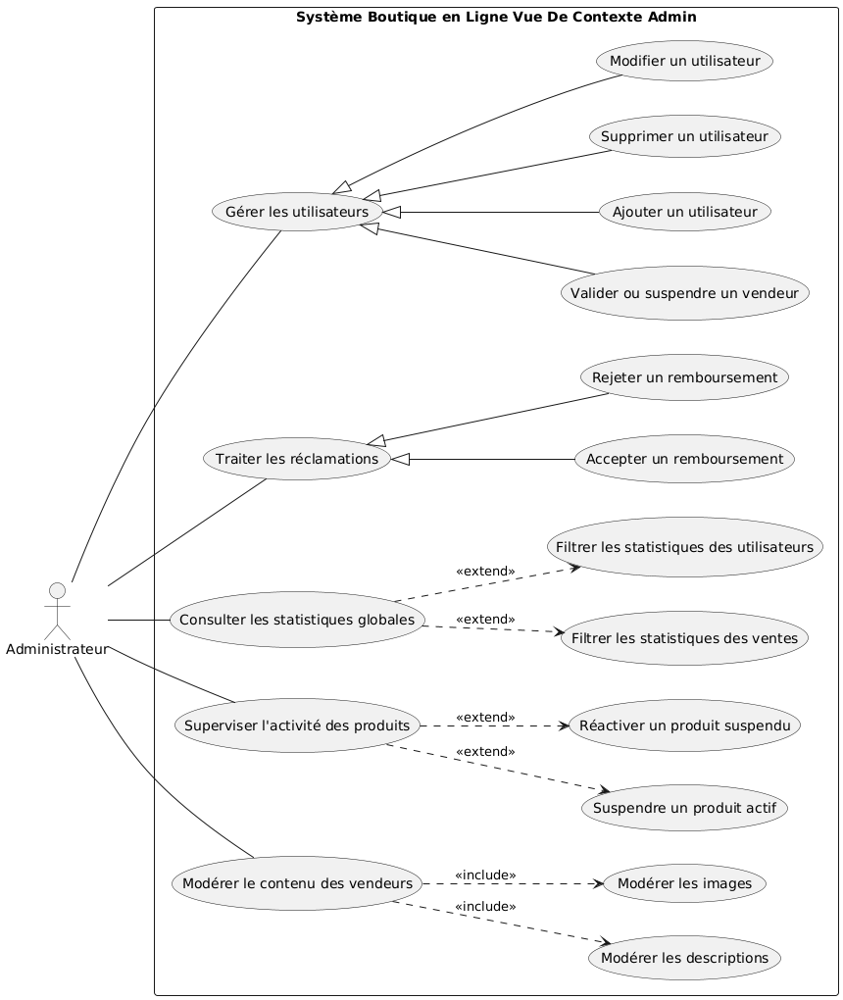
## 🖧 Vue de Déploiement

Cette vue décrit la structure d’hébergement du système : navigateurs, passerelle API, services indépendants, et bases de données.

### 📌 Composants principaux :
- **Frontend Web** (navigateur)
- **API Gateway** (point d’entrée unique)
- **Microservices** (auth, produit, commande, paiement, réclamation…)
- **Bases de données** spécifiques à chaque domaine

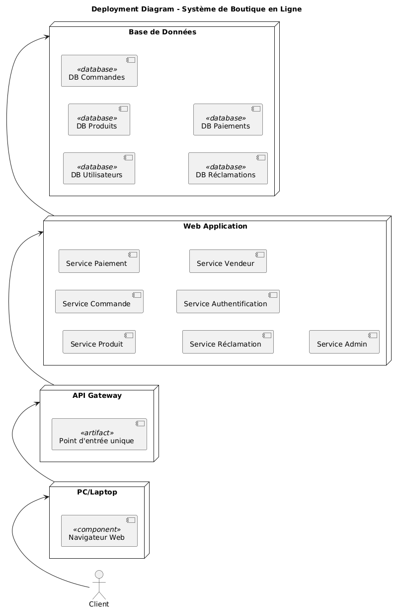

---

## ⚙️ Vue Runtime – Scénario : Passage de Commande

Ce diagramme illustre l'exécution dynamique du système lors du scénario typique d’un client qui passe une commande en ligne.

### 🧩 Étapes :
1. Connexion
2. Consultation produit
3. Création commande
4. Paiement
5. Livraison

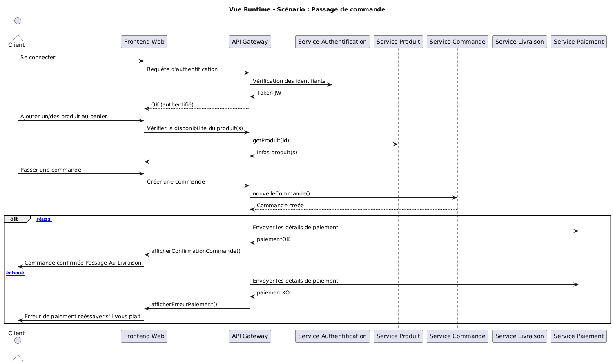

## ⚙️ Vue Runtime – Scénario : Valider Commande

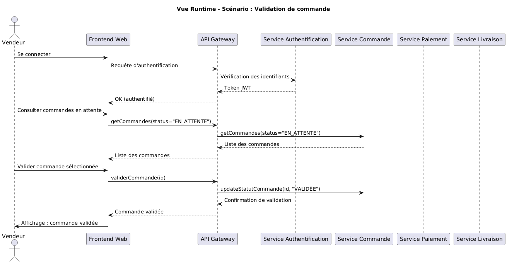

## ⚙️ Vue Building Block

Ce diagramme représente un **diagramme de Building Block** pour un système de boutique en ligne. Voici une description détaillée des éléments et relations :

---

## **1. Classe `Utilisateur` (Classe Parent)**
- **Attributs** :
  - `id` : Identifiant unique de l'utilisateur.
  - `nom` : Nom de l'utilisateur.
  - `email` : Adresse email de l'utilisateur.
  - `motDePasse` : Mot de passe de l'utilisateur.
- **Méthodes** :
  - `seConnecter()` : Permet à l'utilisateur de se connecter au système.
  - `seDeconnecter()` : Permet à l'utilisateur de se déconnecter.

Cette classe est une classe parent pour les rôles spécifiques : `Client`, `Vendeur`, et `Admin`.

---

## **2. Classe `Client` (Héritage de `Utilisateur`)**
- **Méthodes** :
  - `modifierProfil()` : Permet au client de modifier ses informations personnelles.
  - `passerCommande()` : Permet au client de passer une commande.

Le client est associé aux classes suivantes :
- **`Panier`** : Chaque client possède un panier (relation 1 à 1).
- **`Commande`** : Un client peut passer plusieurs commandes (relation 1 à 0..*).

---

## **3. Classe `Vendeur` (Héritage de `Utilisateur`)**
- **Méthodes** :
  - `gererProduits()` : Permet au vendeur de gérer ses produits (ajouter, modifier, supprimer).
  - `consulterCommandes()` : Permet au vendeur de consulter les commandes passées par les clients.

Le vendeur est principalement lié à la gestion des produits et des commandes.

---

## **4. Classe `Admin` (Héritage de `Utilisateur`)**
- **Méthodes** :
  - `gererUtilisateurs()` : Permet de gérer les comptes des utilisateurs (clients et vendeurs).
  - `gererVendeurs()` : Permet de superviser les vendeurs.
  - `superviserSysteme()` : Permet de superviser l'ensemble du système.

L'admin a un rôle de supervision et de gestion globale.

---

## **5. Classe `Panier`**
- **Attributs** :
  - `id` : Identifiant unique du panier.
  - `dateCreation` : Date de création du panier.
- **Méthodes** :
  - `ajouterProduit()` : Permet d'ajouter un produit au panier.
  - `supprimerProduit()` : Permet de retirer un produit du panier.
  - `calculerTotal()` : Calcule le total des produits dans le panier.

Un panier est lié à plusieurs produits (relation * à *).

---

## **6. Classe `Produit`**
- **Attributs** :
  - `id` : Identifiant unique du produit.
  - `nom` : Nom du produit.
  - `description` : Description du produit.
  - `prix` : Prix du produit.
  - `stock` : Quantité disponible en stock.
  - `categorie` : Catégorie du produit.

Les produits sont gérés par les vendeurs et ajoutés au panier par les clients.

---

## **7. Classe `Commande`**
- **Attributs** :
  - `id` : Identifiant unique de la commande.
  - `dateCommande` : Date de la commande.
  - `statut` : Statut de la commande (ex. : en cours, expédiée, annulée).
  - `montantTotal` : Montant total de la commande.
- **Méthodes** :
  - `suivreCommande()` : Permet de suivre l'état de la commande.
  - `annulerCommande()` : Permet d'annuler une commande.

Une commande est associée à un client et peut inclure un paiement.

---

## **8. Classe `Paiement`**
- **Attributs** :
  - `id` : Identifiant unique du paiement.
  - `montant` : Montant du paiement.
  - `methode` : Méthode de paiement (ex. : carte bancaire, PayPal).
  - `statut` : Statut du paiement (ex. : réussi, échoué).
- **Méthodes** :
  - `effectuerPaiement()` : Permet de traiter un paiement.

Le paiement est lié à une commande.

---

## **9. Classe `Reclamation`**
- **Attributs** :
  - `id` : Identifiant unique de la réclamation.
  - `sujet` : Sujet de la réclamation.
  - `message` : Message détaillant la réclamation.
  - `statut` : Statut de la réclamation (ex. : en cours, résolue).
  - `dateCreation` : Date de création de la réclamation.
- **Méthodes** :
  - `creerReclamation()` : Permet de soumettre une réclamation.

Une réclamation est liée à un client et peut être suivie par le support.

---

## **10. Classe `Support`**
- **Méthodes** :
  - `contacterParEmail()` : Permet de contacter le support par email.
  - `contacterParChat()` : Permet de contacter le support via un chat.

Le support est lié à la gestion des réclamations.

---

## **Relations Principales**
1. **Héritage** :
   - `Client`, `Vendeur`, et `Admin` héritent de la classe `Utilisateur`.
2. **Associations** :
   - `Client` est associé à `Panier`, `Commande`, et `Reclamation`.
   - `Commande` est associée à `Paiement`.
   - `Panier` est associé à plusieurs `Produit`.
   - `Reclamation` est associée à `Support`.

---

Ce diagramme illustre les rôles, responsabilités, et relations entre les différentes entités du système de boutique en ligne.

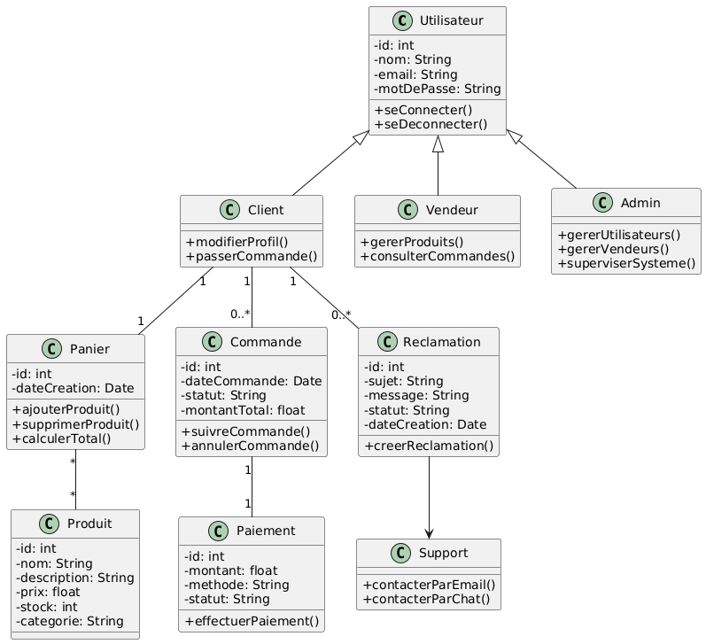

## 🔍 Diagramme de Raffinement

# Description du Diagramme de Raffinement – Gestion de la Commande

Ce diagramme de raffinement illustre les étapes clés et les interactions nécessaires pour gérer une commande dans le système de boutique en ligne. Il décompose le processus en plusieurs sous-activités pour offrir une vue détaillée des opérations.

---

## **1. Gérer commande**
Cette étape représente les actions principales liées à la gestion des commandes. Elle inclut :
- **Créer commande** : Génération d'une nouvelle commande à partir du panier.
- **Enregistrer commande** : Sauvegarde des informations de la commande dans la base de données.
- **Valider commande** : Confirmation de la commande par le client.
- **Annuler commande** : Permet au client ou au système d'annuler une commande en cas de problème.

---

## **2. Traiter commande**
Une fois la commande créée, elle passe par un processus de traitement. Les sous-activités incluent :
- **Vérifier stock** : Vérification de la disponibilité des produits commandés.
- **Réserver produits** : Réservation des produits dans le stock pour éviter les conflits.
- **Confirmer paiement** : Validation du paiement effectué par le client.
- **Historiser les opérations** : Enregistrement des étapes du traitement pour le suivi et la traçabilité.

---

## **3. Suivre livraison**
Après le traitement de la commande, le système passe à la gestion de la livraison. Cette étape inclut :
- Suivi de l'expédition des produits.
- Mise à jour du statut de la commande pour le client.
- Coordination avec les services de livraison externes.

---

## **Transitions**
- **Entre "Gérer commande" et "Traiter commande"** : Une commande validée passe automatiquement au traitement.
- **Entre "Traiter commande" et "Suivre livraison"** : Une commande traitée est prête à être expédiée.

---

## **Résumé**
Ce diagramme de raffinement offre une vue claire des interactions entre les différentes étapes du processus de gestion des commandes. Il met en évidence les flux critiques, tels que la vérification du stock, la validation du paiement, et le suivi de la livraison, pour garantir une expérience utilisateur fluide et efficace.
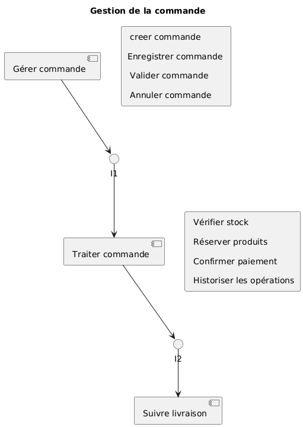
---

Ce diagramme de raffinement offre une vue claire des interactions entre les acteurs, les services, et les bases de données, tout en soulignant les flux critiques du système.

# Description du Diagramme de Raffinement – Gestion du Stock, Produit, et Notification

Ce diagramme de raffinement illustre les étapes clés et les interactions nécessaires pour gérer le stock, les produits, et les notifications dans le système de boutique en ligne. Il décompose le processus en plusieurs sous-activités pour offrir une vue détaillée des opérations.

---

## **1. Gérer stock**
Cette étape représente les actions principales liées à la gestion du stock. Elle inclut :
- **Vérifier le stock** : Contrôle de la disponibilité des produits en stock.
- **Mise à jour du stock** : Modification des quantités disponibles en fonction des opérations (ajout ou retrait).
- **Consulter les alertes de seuil** : Surveillance des niveaux critiques de stock pour éviter les ruptures.

---

## **2. Gérer produit**
Une fois le stock vérifié, le système passe à la gestion des produits. Les sous-activités incluent :
- **Scanner le code produit** : Identification des produits via un code unique (exemple : code-barres).
- **Modifier la quantité** : Ajustement des quantités disponibles pour un produit spécifique.
- **Valider les opérations** : Confirmation des modifications apportées au produit.
- **Historiser les opérations** : Enregistrement des actions effectuées pour le suivi et la traçabilité.

---

## **3. Gérer notification**
Après la gestion des produits, le système passe à la gestion des notifications. Cette étape inclut :
- **Envoi d'alertes** : Notification des vendeurs ou administrateurs en cas de seuil critique atteint.
- **Mise à jour des statuts** : Indication des actions nécessaires pour résoudre les problèmes liés au stock.
- **Coordination** : Communication avec les parties concernées pour garantir une gestion efficace.

---

## **Transitions**
- **Entre "Gérer stock" et "Gérer produit"** : Une fois le stock vérifié, les produits peuvent être modifiés ou ajustés.
- **Entre "Gérer produit" et "Gérer notification"** : Les modifications apportées aux produits déclenchent des notifications si nécessaire.

---

## **Résumé**
Ce diagramme de raffinement offre une vue claire des interactions entre les différentes étapes du processus de gestion du stock, des produits, et des notifications. Il met en évidence les flux critiques, tels que la vérification du stock, la modification des produits, et l'envoi des alertes, pour garantir une gestion efficace et proactive.

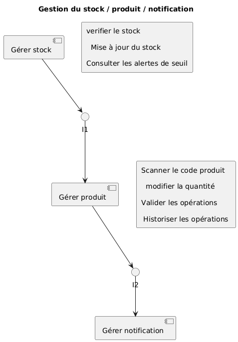
## 🔄 Diagramme FSM – Gestion des Commandes

# Description du Diagramme FSM – Gestion des Commandes

Ce diagramme représente un **modèle FSM (Facteur, Critère, Métrique)** pour évaluer les aspects clés du système de gestion des commandes dans une boutique en ligne. Voici une description détaillée des éléments :

---

## **1. Facteurs**
Les facteurs sont les grandes catégories qui définissent les objectifs principaux du système :
- **Pertinence Fonctionnelle** : Évalue la capacité du système à répondre aux besoins fonctionnels.
- **Performance** : Mesure la rapidité et l'efficacité du système.
- **Sécurité** : Évalue la protection des données et la confidentialité.

---

## **2. Critères**
Les critères sont des sous-catégories qui détaillent les facteurs :
### **Pertinence Fonctionnelle**
- **Précision** : Capacité à afficher des résultats détaillés et exacts (exemple : historique des commandes ou produits).
- **Conformité** : Respect des exigences définies dans le cahier des charges.
- **Ergonomie** : Facilité d'utilisation et interface utilisateur intuitive.
- **Fiabilité** : Disponibilité et stabilité du système.

### **Performance**
- **Temps de réponse** : Rapidité d'exécution des actions (exemple : temps de réponse inférieur à 2 secondes).

### **Sécurité**
- **Confidentialité** : Protection des données utilisateur et limitation des accès.
  - Un seul rôle/login par utilisateur.
  - Paiement sécurisé.

---

## **3. Métriques**
Les métriques sont des indicateurs mesurables pour évaluer les critères :
### **Pertinence Fonctionnelle**
- **Précision** : Affichage des résultats détaillés (exemple : historique des commandes ou produits).
- **Conformité** : Vérification par rapport au cahier des charges.
- **Ergonomie** : Utilisation de couleurs conformes et claires pour une interface intuitive.
- **Fiabilité** : Haute disponibilité du système (24h/24, 7j/7).

### **Performance**
- **Temps de réponse** : Mesure du temps d'exécution des actions (exemple : < 2 secondes).

### **Sécurité**
- **Confidentialité** :
  - Un seul rôle/login par utilisateur.
  - Paiement sécurisé pour protéger les données financières.

---

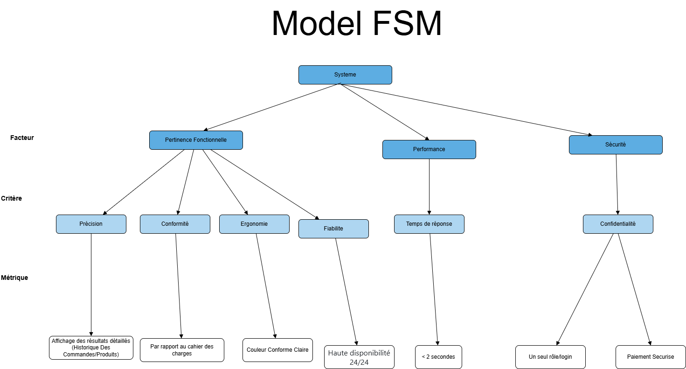

## **Résumé**
Ce diagramme FSM permet de structurer l'évaluation des fonctionnalités, de la performance et de la sécurité du système. Il aide à identifier les points forts et les axes d'amélioration pour garantir une expérience utilisateur optimale et sécurisée.

<!-- ## 🧱 Vue Building Block – Architecture des Composants

La vue **Building Block** présente l'architecture interne du système de la boutique en ligne. Elle met en évidence les principaux composants logiciels (ou "blocs") qui composent le système, leurs responsabilités et leurs interactions via une architecture orientée microservices.

### 📌 Description des Blocs

- **Frontend Web Client** :  
  Interface utilisateur disponible via navigateur pour clients, vendeurs et administrateurs.

- **API Gateway** :  
  Point d'entrée unique pour l'ensemble des requêtes. Elle redirige vers les services appropriés.

- **Service Authentification** :  
  Gère la connexion, l'inscription, les tokens JWT, et la sécurité des accès.

- **Service Client** :  
  Gère les données personnelles, adresses, et interactions des clients.

- **Service Vendeur** :  
  Permet aux vendeurs de gérer leur boutique (produits, commandes, stock).

- **Service Commande** :  
  Gère le panier, les commandes, le suivi et l’historique.

- **Service Paiement** :  
  Intègre des services externes (Stripe, PayPal) et valide les paiements.

- **Service Produit** :  
  Gère les produits, les catégories, les descriptions et le stock disponible.

- **Service Réclamation** :  
  Gère les demandes et réclamations des utilisateurs et leur suivi.

- **Service Admin** :  
  Gère les utilisateurs, les vendeurs, les statistiques et la supervision générale.

- **Bases de Données** :
  - `DB Utilisateurs` : Clients, vendeurs, administrateurs
  - `DB Produits` : Informations produits et stock
  - `DB Commandes` : Historique et statut des commandes
  - `DB Réclamations` : Données des réclamations client
  - `DB Paiements` : Données de transaction sécurisées

### 🖼 Diagramme Building Block

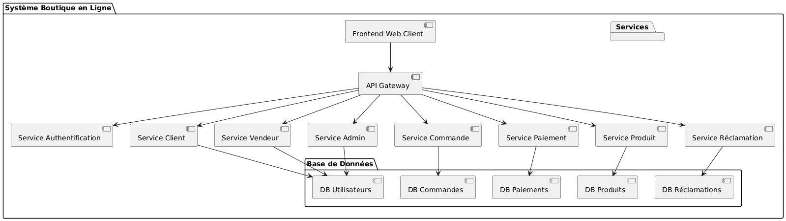

---

Cette architecture permet une scalabilité horizontale, une séparation claire des responsabilités et une maintenance facilitée grâce à l’indépendance des modules. -->

